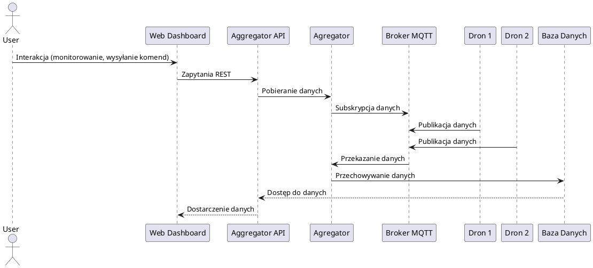

# Dokumentacja Zarządzania Ekosystemem MQTT (Broker & Aggregator) w Docker i Kubernetes

## Spis Treści

1. [Wprowadzenie](#1-wprowadzenie)
2. [Zaawansowany Kurs Docker](#2-zaawansowany-kurs-docker)
    - [2.1 Podstawowe Komendy Docker (Szybkie Przypomnienie)](#21-podstawowe-komendy-docker-szybkie-przypomnienie)
    - [2.2 Zarządzanie Kontenerami](#22-zarz%C4%85dzanie-kontenerami)
    - [2.3 Budowanie i Optymalizacja Obrazów](#23-budowanie-i-optymalizacja-obraz%C3%B3w)
        - [2.3.1 Przykładowy Dockerfile](#231-przyk%C5%82adowy-dockerfile)
        - [2.3.2 Budowanie Obrazu](#232-budowanie-obrazu)
        - [2.3.3 Optymalizacja Obrazów](#233-optymalizacja-obraz%C3%B3w)
    - [2.4 Docker Compose](#24-docker-compose)
        - [2.4.1 docker-compose.yml – Przykład](#241-docker-composeyml--przyk%C5%82ad)
        - [2.4.2 Uruchamianie Docker Compose](#242-uruchamianie-docker-compose)
    - [2.5 Woluminy i Sieci](#25-woluminy-i-sieci)
        - [2.5.1 Woluminy](#251-woluminy)
        - [2.5.2 Sieci](#252-sieci)
    - [2.6 Docker w Produkcji i Best Practices](#26-docker-w-produkcji-i-best-practices)
    - [Podsumowanie](#podsumowanie)
3. [Kubernetes – Orkiestracja Kontenerów](#3-kubernetes---orkiestracja-kontenerow)
4. [Docker w Chmurach Hybrydowych](#4-docker-w-chmurach-hybrydowych)
5. [Zarządzanie Rojem Dronów w Kubernetes](#5-zarz%C4%85dzanie-rojem-dron%C3%B3w-w-kubernetes)
6. [Opis Projektu](#6-opis-projektu)
    - [Kontekst i Motywacja](#kontekst-i-motywacja)
    - [Główne Cele Projektu](#g%C5%82%C3%B3wne-cele-projektu)
    - [Architektura Projektu](#architektura-projektu)
    - [Korzyści z Implementacji](#korzy%C4%99ci-z-implementacji)
    - [Architektura Systemu](#architektura-systemu)
    - [Opis Komponentów](#opis-komponent%C3%B3w)
    - [Integracja i Przepływ Danych](#integracja-i-przep%C5%82yw-danych)
7. [Podsumowanie](#7-podsumowanie)
8. [Wymagania Systemowe](#8-wymagania-systemowe)
9. [Instalacja](#9-instalacja)
    - [Klony Repozytorium](#klony-repozytorium)
    - [Konfiguracja Środowiska](#konfiguracja-%C5%9Brodowiska)
    - [Uruchomienie Usług](#uruchomienie-us%C5%82ug)
10. [Konfiguracja](#10-konfiguracja)
    - [Konfiguracja Brokera MQTT](#konfiguracja-brokera-mqtt)
    - [Konfiguracja Agregatora](#konfiguracja-agregatora)
    - [Konfiguracja Aggregator API](#konfiguracja-aggregator-api)
    - [Konfiguracja Bazy Danych](#konfiguracja-bazy-danych)
    - [Konfiguracja Interfejsu Użytkownika](#konfiguracja-interfejsu-u%C5%BCytkownika)
11. [Używanie](#11-u%C5%BCywanie)
    - [Monitorowanie Stanu Systemu](#monitorowanie-stanu-systemu)
    - [Zarządzanie Dronami](#zarz%C4%85dzanie-dronami)
12. [Przykłady](#12-przyk%C5%82ady)
    - [Publikowanie Danych przez Drona](#publikowanie-danych-przez-drona)
    - [Pobieranie Statusu Drona przez API](#pobieranie-statusu-drona-przez-api)
13. [Testowanie](#13-testowanie)
    - [Testy Jednostkowe](#testy-jednostkowe)
    - [Testy Integracyjne](#testy-integracyjne)
    - [Testy End-to-End](#testy-end-to-end)
14. [Licencja](#14-licencja)
15. [Informacje z Istniejących Plików](#15-informacje-z-istniej%C4%85cych-plik%C3%B3w)
16. [Odnośniki](#16-odno%C5%9Bniki)

---

## 1. Wprowadzenie

Witaj w dokumentacji dotyczącej zarządzania ekosystemem MQTT (Broker & Aggregator) w środowisku Docker i Kubernetes. Projekt ten koncentruje się na symulacji roju dronów, gdzie każdy dron jest traktowany jako niezależny kontener. Dzięki temu podejściu możliwe jest autonomiczne działanie każdego drona oraz efektywna komunikacja z innymi elementami systemu.

### **Dlaczego MQTT i Kubernetes?**

- **MQTT (Message Queuing Telemetry Transport)**: Lekki protokół komunikacyjny idealny dla środowisk IoT, takich jak roje dronów. Umożliwia efektywną wymianę danych pomiędzy dużą liczbą urządzeń.
- **Kubernetes**: Potężna platforma do orkiestracji kontenerów, która zapewnia skalowalność, niezawodność oraz automatyzację zarządzania aplikacjami kontenerowymi.

### **Cel Dokumentacji**

Dokumentacja jest podzielona na dwie główne części:

- **`README.MD`**: Ogólny opis projektu, jego celów oraz struktury.
- **`_docs/readme.md`**: Szczegółowe informacje dotyczące implementacji, konfiguracji i zarządzania poszczególnymi komponentami projektu.

Aby przejść do bardziej szczegółowej dokumentacji, kliknij [tutaj](./_docs/readme.md).

### **Kontekst i Motywacja**

W erze dynamicznie rozwijającego się Internetu Rzeczy (IoT), roje dronów stają się coraz bardziej istotne w różnych zastosowaniach, takich jak monitorowanie środowiska, inspekcje infrastruktury czy operacje ratunkowe. Zarządzanie taką liczbą autonomicznych urządzeń wymaga zaawansowanych narzędzi i technologii, które umożliwią efektywną komunikację, skalowalność oraz niezawodność systemu.

### **Główne Cele Projektu**

Projekt ma na celu stworzenie skalowalnego i elastycznego systemu do zarządzania rojem dronów, wykorzystując technologię konteneryzacji (Docker) oraz orkiestrację kontenerów (Kubernetes). Dzięki integracji protokołu MQTT, system umożliwia efektywną wymianę danych pomiędzy dronami a centralnymi komponentami, takimi jak agregator danych i interfejsy API.

### **Architektura Projektu**

Architektura projektu została zaprojektowana w celu zapewnienia modularności, skalowalności i niezawodności. Składa się z następujących kluczowych komponentów:

1. **Drony**: Symulowane jako autonomiczne kontenery, generujące i publikujące dane do brokera MQTT.
2. **Broker MQTT**: Centralny punkt komunikacji, odbierający dane od dronów i dystrybuujący je do subskrybentów.
3. **Agregator**: Komponent subskrybujący dane z brokera MQTT, przetwarzający je i przygotowujący do dalszej analizy.
4. **Aggregator API**: REST API umożliwiające dostęp do przetworzonych danych oraz zarządzanie rojem dronów.
5. **Baza Danych**: Przechowuje zebrane dane, umożliwiając ich analizę i raportowanie.
6. **Interfejs Użytkownika**: Webowy dashboard umożliwiający monitorowanie stanu roju oraz interakcję z dronami.

### **Korzyści z Implementacji**

#### Zalety Takiego Rozwiązania

- **Skalowalność:**
  - **Dynamiczne Przydzielanie Zasobów:** W środowisku chmurowym liczba aktywnych dronów może być elastycznie dostosowywana do bieżącego zapotrzebowania. Wzrost obciążenia umożliwia łatwe dodawanie nowych instancji, natomiast spadek – redukcję ich liczby.
  - **Horizontalne Skalowanie:** Kubernetes ułatwia skalowanie poziome, co pozwala systemowi obsługiwać zmienne obciążenia poprzez rozdzielanie dronów na wiele węzłów.

- **Elastyczność i Modularność:**
  - **Niezależny Rozwój:** Konteneryzacja umożliwia niezależny rozwój, testowanie i wdrażanie poszczególnych komponentów systemu, co zwiększa modularność i ułatwia integrację nowych funkcjonalności bez wpływu na działające elementy.
  - **Architektura Mikroserwisów:** Przyjęcie podejścia mikroserwisowego pozwala na rozwój, wdrażanie i skalowanie każdego serwisu niezależnie, co zwiększa ogólną elastyczność systemu.

- **Automatyzacja:**
  - **Continuous Integration/Continuous Deployment (CI/CD):** Zautomatyzowane pipeline'y CI/CD usprawniają proces budowania, testowania i wdrażania aplikacji, co pozwala na szybkie i niezawodne przenoszenie zmian kodu do środowisk produkcyjnych.
  - **Infrastructure as Code (IaC):** Narzędzia takie jak Terraform i Helm Charts umożliwiają automatyzację provisioning’u infrastruktury oraz zarządzanie konfiguracją, minimalizując ręczne interwencje i potencjalne błędy.

- **Oszczędność Zasobów:**
  - **Optymalne Wykorzystanie Chmury:** Efektywne zarządzanie zasobami chmurowymi oraz automatyczne skalowanie pozwala na minimalizację kosztów poprzez płacenie tylko za faktycznie wykorzystywaną infrastrukturę.
  - **Zarządzanie Kosztami:** Dostawcy chmury oferują różnorodne modele cenowe oraz narzędzia do zarządzania kosztami, które pomagają monitorować i optymalizować wydatki w zależności od wzorców wykorzystania.

#### Wyzwania i Ograniczenia

- **Złożoność Architektury:**
  - **Wymagania Techniczne:** Zarządzanie dużym rojem kontenerów wymaga dogłębnej wiedzy na temat technologii chmurowych, protokołów komunikacyjnych oraz narzędzi do monitoringu i zabezpieczeń.
  - **Integracja Systemów:** Zapewnienie płynnej integracji między różnymi komponentami i usługami zwiększa złożoność architektoniczną systemu.

- **Nadmiarowe Koszty i Opóźnienia:**
  - **Koszty Operacyjne:** Chociaż elastyczność chmury jest korzystna, może prowadzić do wyższych kosztów operacyjnych, jeśli nie jest odpowiednio zarządzana.
  - **Opóźnienia Sieciowe:** Zwiększony ruch sieciowy oraz czas reakcji brokerów MQTT, baz danych czy systemów monitoringu mogą wprowadzać opóźnienia w komunikacji, co może negatywnie wpływać na operacje w czasie rzeczywistym.

- **Bezpieczeństwo:**
  - **Ochrona Danych:** Autonomiczne drony komunikujące się w rozproszonym środowisku chmurowym muszą być chronione przed nieautoryzowanym dostępem, atakami i wyciekami danych.
  - **Zaawansowane Środki Bezpieczeństwa:** Konieczne jest wdrożenie solidnych polityk bezpieczeństwa, mechanizmów uwierzytelniania oraz technik szyfrowania, aby zabezpieczyć system przed potencjalnymi zagrożeniami.

---

## 2. Zaawansowany Kurs Docker

W tej sekcji omówione zostaną zaawansowane aspekty korzystania z Docker, które są kluczowe dla efektywnego wdrażania i utrzymania aplikacji w środowisku kontenerowym.

### 2.1 Podstawowe Komendy Docker (Szybkie Przypomnienie)

Krótki przegląd podstawowych komend Docker, które są niezbędne do zarządzania kontenerami, obrazami i sieciami.

- [Szczegółowy opis](./_docs/readme.md#21-podstawowe-komendy-docker-szybkie-przypomnienie)

### 2.2 Zarządzanie Kontenerami

Zaawansowane techniki zarządzania kontenerami, w tym tworzenie, uruchamianie, zatrzymywanie oraz usuwanie kontenerów.

- [Szczegółowy opis](./_docs/readme.md#22-zarz%C4%85dzanie-kontenerami)

### 2.3 Budowanie i Optymalizacja Obrazów

#### 2.3.1 Przykładowy Dockerfile

Przykład Dockerfile pokazujący, jak zdefiniować obraz Dockerowy dla aplikacji.

- [Szczegółowy opis](./_docs/readme.md#231-przyk%C5%82adowy-dockerfile)

#### 2.3.2 Budowanie Obrazu

Instrukcje dotyczące budowania obrazów Dockerowych na podstawie Dockerfile.

- [Szczegółowy opis](./_docs/readme.md#232-budowanie-obrazu)

#### 2.3.3 Optymalizacja Obrazów

Metody optymalizacji obrazów Dockerowych w celu zmniejszenia ich rozmiaru i poprawy wydajności.

- [Szczegółowy opis](./_docs/readme.md#233-optymalizacja-obraz%C3%B3w)

### 2.4 Docker Compose

#### 2.4.1 docker-compose.yml – Przykład

Przykładowy plik `docker-compose.yml` ilustrujący konfigurację usług.

- [Szczegółowy opis](./_docs/readme.md#241-docker-composeyml--przyk%C5%82ad)

#### 2.4.2 Uruchamianie Docker Compose

Kroki niezbędne do uruchomienia i zarządzania usługami za pomocą Docker Compose.

- [Szczegółowy opis](./_docs/readme.md#242-uruchamianie-docker-compose)

### 2.5 Woluminy i Sieci

#### 2.5.1 Woluminy

Zarządzanie danymi trwałymi przy użyciu woluminów Dockerowych.

- [Szczegółowy opis](./_docs/readme.md#251-woluminy)

#### 2.5.2 Sieci

Konfiguracja i zarządzanie sieciami Dockerowymi w celu zapewnienia komunikacji między kontenerami.

##### **Rozbudowany Diagram Sieci z Opisami Procesów Komunikacji**

Poniżej znajduje się szczegółowy diagram architektury sieciowej systemu wraz z opisami procesów komunikacji między komponentami.

```
                                   +-------------------------------+
                                   |         Broker MQTT          |
                                   |         (Mosquitto)          |
                                   +-------------------------------+
                                                 ^
                                                 |
                   +-----------------------------+-----------------------------+
                   |                             |                             |
        +----------v----------+     +----------v----------+     +----------v----------+
        |       Dron 1        |     |       Dron 2        |     |       Dron N        |
        | Publikuje dane MQTT |     | Publikuje dane MQTT |     | Publikuje dane MQTT |
        +---------------------+     +---------------------+     +---------------------+
                   |                             |                             |
                   | Publikacja danych            | Publikacja danych            | Publikacja danych
                   |                             |                             |
                   +-------------+---------------+---------------+-------------+
                                 |                               |
                                 | Subskrypcja danych            | Subskrypcja danych
                                 |                               |
                                 v                               v
                                   +-------------------------------+
                                   |          Agregator           |
                                   |   (Subskrybuje topic MQTT)   |
                                   +-------------------------------+
                                                 |
                                                 | Przetwarzanie i analiza danych
                                                 |
                                                 v
                                   +-------------------------------+
                                   |        Aggregator API        |
                                   |    (REST API dla danych)     |
                                   +-------------------------------+
                                                 |
                                                 | Dostęp do danych i zarządzanie rojem
                                                 |
                                                 v
                                   +-------------------------------+
                                   |          Baza Danych          |
                                   |      (PostgreSQL/MySQL)       |
                                   +-------------------------------+
                                                 |
                                                 | Udostępnianie danych do UI
                                                 |
                                                 v
                                   +-------------------------------+
                                   |      Interfejs Użytkownika    |
                                   |        (Web Dashboard)        |
                                   +-------------------------------+
```

### Opisy Procesów Komunikacji

1. **Publikacja Danych przez Drony:**
   - **Drony (Dron 1, Dron 2, ..., Dron N)** generują i publikują dane na dedykowanych topikach MQTT, takich jak `drones/{drone_id}/position`. Dane te obejmują informacje o pozycji, stanie baterii oraz inne istotne parametry.

2. **Subskrypcja Danych przez Agregator:**
   - **Agregator** subskrybuje wszystkie topiki związane z pozycją dronów (`drones/+/position`) i odbiera publikowane dane. Dzięki temu agregator może zbierać informacje z całego roju dronów w czasie rzeczywistym.

3. **Przetwarzanie i Analiza Danych przez Agregator:**
   - Po otrzymaniu danych, **Agregator** przetwarza je i analizuje w celu monitorowania stanu dronów, wykrywania potencjalnych problemów oraz optymalizacji działań roju.

4. **Udostępnianie Danych przez Aggregator API:**
   - **Aggregator API** udostępnia przetworzone dane za pośrednictwem REST API, umożliwiając zewnętrznym aplikacjom oraz interfejsowi użytkownika (UI) dostęp do informacji o stanie dronów oraz zarządzanie nimi.

5. **Przechowywanie Danych w Bazie Danych:**
   - **Baza Danych** (np. PostgreSQL lub MySQL) przechowuje wszystkie zebrane dane, umożliwiając ich późniejszą analizę, raportowanie oraz historyczne monitorowanie stanu dronów.

6. **Interakcja z Interfejsem Użytkownika:**
   - **Interfejs Użytkownika (Web Dashboard)** prezentuje wizualizacje danych, umożliwia monitorowanie stanu roju w czasie rzeczywistym oraz interakcję z dronami poprzez wysyłanie komend sterujących.

### 2.6 Docker w Produkcji i Best Practices

Najlepsze praktyki stosowane podczas wdrażania Docker w środowiskach produkcyjnych, w tym bezpieczeństwo, monitorowanie i skalowanie.

- [Szczegółowy opis](./_docs/readme.md#26-docker-w-produkcji-i-best-practices)

### Podsumowanie

Sekcja ta dostarcza zaawansowaną wiedzę na temat Docker, umożliwiając efektywne wykorzystanie kontenerów w projekcie zarządzania rojem dronów. Zapewnienie optymalnych obrazów, skuteczne zarządzanie kontenerami oraz stosowanie najlepszych praktyk jest kluczowe dla skalowalności i niezawodności systemu.

---

## 3. Kubernetes – Orkiestracja Kontenerów

Kubernetes jest kluczowym elementem orkiestracji kontenerów w naszym projekcie. Szczegółowe informacje znajdziesz w sekcji [Kubernetes – Orkiestracja Kontenerów](./_docs/readme.md#3-kubernetes---orkiestracja-kontenerow).

---

## 4. Docker w Chmurach Hybrydowych

Docker w połączeniu z chmurami hybrydowymi umożliwia elastyczne zarządzanie zasobami. Dowiedz się więcej w [Sekcji Docker w Chmurach Hybrydowych](./_docs/readme.md#4-docker-w-chmurach-hybrydowych).

---

## 5. Zarządzanie Rojem Dronów w Kubernetes

Zarządzanie dużą liczbą dronów wymaga zaawansowanych technik orkiestracji. Przeczytaj więcej w [Zarządzanie Rojem Dronów w Kubernetes](./_docs/readme.md#5-zarz%C4%85dzanie-rojem-dron%C3%B3w-w-kubernetes).

---

## 6. Opis Projektu

### Kontekst i Motywacja

W erze dynamicznie rozwijającego się Internetu Rzeczy (IoT), roje dronów stają się coraz bardziej istotne w różnych zastosowaniach, takich jak monitorowanie środowiska, inspekcje infrastruktury czy operacje ratunkowe. Zarządzanie taką liczbą autonomicznych urządzeń wymaga zaawansowanych narzędzi i technologii, które umożliwią efektywną komunikację, skalowalność oraz niezawodność systemu.

### Główne Cele Projektu

Projekt ma na celu stworzenie skalowalnego i elastycznego systemu do zarządzania rojem dronów, wykorzystując technologię konteneryzacji (Docker) oraz orkiestrację kontenerów (Kubernetes). Dzięki integracji protokołu MQTT, system umożliwia efektywną wymianę danych pomiędzy dronami a centralnymi komponentami, takimi jak agregator danych i interfejsy API.

### Architektura Projektu

Architektura projektu została zaprojektowana w celu zapewnienia modularności, skalowalności i niezawodności. Składa się z następujących kluczowych komponentów:

1. **Drony**: Symulowane jako autonomiczne kontenery, generujące i publikujące dane do brokera MQTT.
2. **Broker MQTT**: Centralny punkt komunikacji, odbierający dane od dronów i dystrybuujący je do subskrybentów.
3. **Agregator**: Komponent subskrybujący dane z brokera MQTT, przetwarzający je i przygotowujący do dalszej analizy.
4. **Aggregator API**: REST API umożliwiające dostęp do przetworzonych danych oraz zarządzanie rojem dronów.
5. **Baza Danych**: Przechowuje zebrane dane, umożliwiając ich analizę i raportowanie.
6. **Interfejs Użytkownika**: Webowy dashboard umożliwiający monitorowanie stanu roju oraz interakcję z dronami.

### Korzyści z Implementacji

#### Zalety Takiego Rozwiązania

- **Skalowalność:**
  - **Dynamiczne Przydzielanie Zasobów:** W środowisku chmurowym liczba aktywnych dronów może być elastycznie dostosowywana do bieżącego zapotrzebowania. Wzrost obciążenia umożliwia łatwe dodawanie nowych instancji, natomiast spadek – redukcję ich liczby.
  - **Horizontalne Skalowanie:** Kubernetes ułatwia skalowanie poziome, co pozwala systemowi obsługiwać zmienne obciążenia poprzez rozdzielanie dronów na wiele węzłów.

- **Elastyczność i Modularność:**
  - **Niezależny Rozwój:** Konteneryzacja umożliwia niezależny rozwój, testowanie i wdrażanie poszczególnych komponentów systemu, co zwiększa modularność i ułatwia integrację nowych funkcjonalności bez wpływu na działające elementy.
  - **Architektura Mikroserwisów:** Przyjęcie podejścia mikroserwisowego pozwala na rozwój, wdrażanie i skalowanie każdego serwisu niezależnie, co zwiększa ogólną elastyczność systemu.

- **Automatyzacja:**
  - **Continuous Integration/Continuous Deployment (CI/CD):** Zautomatyzowane pipeline'y CI/CD usprawniają proces budowania, testowania i wdrażania aplikacji, co pozwala na szybkie i niezawodne przenoszenie zmian kodu do środowisk produkcyjnych.
  - **Infrastructure as Code (IaC):** Narzędzia takie jak Terraform i Helm Charts umożliwiają automatyzację provisioning’u infrastruktury oraz zarządzanie konfiguracją, minimalizując ręczne interwencje i potencjalne błędy.

- **Oszczędność Zasobów:**
  - **Optymalne Wykorzystanie Chmury:** Efektywne zarządzanie zasobami chmurowymi oraz automatyczne skalowanie pozwala na minimalizację kosztów poprzez płacenie tylko za faktycznie wykorzystywaną infrastrukturę.
  - **Zarządzanie Kosztami:** Dostawcy chmury oferują różnorodne modele cenowe oraz narzędzia do zarządzania kosztami, które pomagają monitorować i optymalizować wydatki w zależności od wzorców wykorzystania.

#### Wyzwania i Ograniczenia

- **Złożoność Architektury:**
  - **Wymagania Techniczne:** Zarządzanie dużym rojem kontenerów wymaga dogłębnej wiedzy na temat technologii chmurowych, protokołów komunikacyjnych oraz narzędzi do monitoringu i zabezpieczeń.
  - **Integracja Systemów:** Zapewnienie płynnej integracji między różnymi komponentami i usługami zwiększa złożoność architektoniczną systemu.

- **Nadmiarowe Koszty i Opóźnienia:**
  - **Koszty Operacyjne:** Chociaż elastyczność chmury jest korzystna, może prowadzić do wyższych kosztów operacyjnych, jeśli nie jest odpowiednio zarządzana.
  - **Opóźnienia Sieciowe:** Zwiększony ruch sieciowy oraz czas reakcji brokerów MQTT, baz danych czy systemów monitoringu mogą wprowadzać opóźnienia w komunikacji, co może negatywnie wpływać na operacje w czasie rzeczywistym.

- **Bezpieczeństwo:**
  - **Ochrona Danych:** Autonomiczne drony komunikujące się w rozproszonym środowisku chmurowym muszą być chronione przed nieautoryzowanym dostępem, atakami i wyciekami danych.
  - **Zaawansowane Środki Bezpieczeństwa:** Konieczne jest wdrożenie solidnych polityk bezpieczeństwa, mechanizmów uwierzytelniania oraz technik szyfrowania, aby zabezpieczyć system przed potencjalnymi zagrożeniami.

### Architektura Systemu

Architektura systemu symulacji roju dronów w środowisku kontenerowym i chmurowym została zaprojektowana w celu zapewnienia skalowalności, elastyczności oraz niezawodności. System składa się z kilku kluczowych komponentów, które współpracują ze sobą, umożliwiając efektywne zarządzanie dronami, komunikację oraz analizę danych.

#### Diagram Architektury

```
                               +-------------------------------+
                               |         Broker MQTT          |
                               |         (Mosquitto)          |
                               +-------------------------------+
                                             ^
                                             |
               +-----------------------------+-----------------------------+
               |                             |                             |
    +----------v----------+     +----------v----------+     +----------v----------+
    |       Dron 1        |     |       Dron 2        |     |       Dron N        |
    | Publikuje dane MQTT |     | Publikuje dane MQTT |     | Publikuje dane MQTT |
    +---------------------+     +---------------------+     +---------------------+
                                             |
                                             v
                               +-------------------------------+
                               |          Agregator           |
                               |   (Subskrybuje topic MQTT)   |
                               +-------------------------------+
                                             |
                                             v
                               +-------------------------------+
                               |        Aggregator API        |
                               |    (REST API dla danych)     |
                               +-------------------------------+
                                             |
                                             v
                               +-------------------------------+
                               |          Baza Danych          |
                               |      (PostgreSQL/MySQL)       |
                               +-------------------------------+
                                             |
                                             v
                               +-------------------------------+
                               |      Interfejs Użytkownika    |
                               |        (Web Dashboard)        |
                               +-------------------------------+
```

### Opis Komponentów

#### 1. **Drony (`drones/`)**

- **Rola:** Symulacja autonomicznych dronów w systemie.
- **Funkcje:**
  - **Generowanie Danych:** Każdy dron generuje informacje dotyczące swojej pozycji, stanu baterii oraz innych istotnych parametrów.
  - **Publikowanie Danych:** Dane są publikowane na brokerze MQTT, umożliwiając ich dalszą dystrybucję.
  - **Odbiór Komend:** Drony odbierają komendy sterujące z agregatora lub API, co pozwala na ich zdalne kontrolowanie.
- **MQTT Topic:**
  ```plaintext
  drones/{drone_id}/position
  ```
- **Szczegółowa Dokumentacja:** [Dokumentacja Dronów](./_docs/drones_component.md)
- **Pliki:** [Kod drona i konfiguracja](drones/)

#### 2. **Broker MQTT (`server/mqtt/`)**

- **Rola:** Centralny węzeł komunikacyjny systemu.
- **Funkcje:**
  - **Odbieranie Danych:** Broker MQTT odbiera dane publikowane przez drony.
  - **Dystrybucja Danych:** Rozsyła odebrane dane do subskrybujących komponentów, takich jak agregator.
- **Konfiguracja:**
  - **Deployment:** Wdrażany w Kubernetes jako usługa z wykorzystaniem Mosquitto, co zapewnia skalowalność i niezawodność.
- **Pliki:** [Konfiguracja MQTT](server/mqtt/)
- **Szczegółowe Wyjaśnienie:** [Dokumentacja Brokera MQTT](./_docs/broker_mqtt.md)

#### 3. **Agregator (`aggregator/`)**

- **Rola:** Zbieranie i przetwarzanie danych od dronów.
- **Funkcje:**
  - **Subskrypcja Danych:** Subskrybuje odpowiednie topiki MQTT, aby odbierać dane publikowane przez drony.
  - **Agregacja i Analiza:** Agreguje i analizuje dane w czasie rzeczywistym, umożliwiając natychmiastową reakcję na zmieniające się warunki.
  - **Przechowywanie i Przekazywanie Danych:** Może zapisywać dane do bazy danych lub przekazywać je dalej do API, w zależności od potrzeb.
- **MQTT Subskrypcja:**
  ```plaintext
  drones/+/position
  ```
- **Pliki:** [Kod agregatora](aggregator/)
- **Szczegółowe Wyjaśnienie:** [Szczegółowy opis agregatora](./_docs/aggregator_details.md)

#### 4. **Aggregator API (`aggregator-api/`)**

- **Rola:** Interfejs REST do dostępu do przetworzonych danych dronów. Umożliwia zewnętrznym systemom i użytkownikom pobieranie informacji o stanie dronów, wysyłanie komend i zarządzanie rojem.
- **Funkcje:**
  - **Udostępnianie Danych:** Dostarcza zebrane dane z agregatora za pomocą REST API, umożliwiając dostęp do nich zewnętrznym aplikacjom.
  - **Zarządzanie Roju Dronów:** Umożliwia zarządzanie dronami, w tym aktualizację ich parametrów oraz wysyłanie komend sterujących.
  - **Monitorowanie Statusu:** Obsługuje żądania dotyczące statusu dronów, co pozwala na monitorowanie ich bieżącego stanu.
- **Endpointy API:**
  ```http
  GET /api/drones/{drone_id}/status
  POST /api/drones/{drone_id}/update
  GET /api/drones
  ```
- **Pliki:** [Kod API](aggregator-api/)
- **Szczegółowe Wyjaśnienie:** [Szczegółowy opis Aggregator API](./_docs/aggregator_api_details.md)

#### 5. **Baza Danych (`database/`)**

- **Rola:** Przechowywanie zebranych danych z dronów.
- **Funkcje:**
  - **Przechowywanie Danych:** Gromadzi i przechowuje dane dotyczące pozycji, stanu baterii oraz innych parametrów dronów.
  - **Zapytania i Analizy:** Umożliwia wykonywanie zapytań oraz analizowanie danych w celu optymalizacji działania roju.
- **Technologie:** PostgreSQL, MySQL lub inne relacyjne bazy danych.
- **Pliki:** [Konfiguracja bazy danych](database/)
- **Szczegółowe Wyjaśnienie:** [Dokumentacja Bazy Danych](./_docs/database.md)

#### 6. **Interfejs Użytkownika (`frontend/`)**

- **Rola:** Dostarczanie wizualizacji i interakcji dla użytkowników systemu.
- **Funkcje:**
  - **Web Dashboard:** Wizualizacja danych z roju dronów, monitorowanie ich stanu w czasie rzeczywistym.
  - **Interakcje:** Umożliwia użytkownikom wysyłanie komend sterujących, zarządzanie dronami oraz analizowanie zgromadzonych danych.
- **Technologie:** React, Angular, Vue.js lub inne frameworki frontendowe.
- **Pliki:** [Kod interfejsu użytkownika](frontend/)
- **Szczegółowe Wyjaśnienie:** [Dokumentacja Frontend](./_docs/frontend.md)

---

## 7. Podsumowanie

Dokumentacja ta dostarcza kompleksowego przewodnika po zarządzaniu ekosystemem MQTT oraz rojem dronów w środowisku Docker i Kubernetes. Dzięki integracji konteneryzacji, orkiestracji, komunikacji MQTT, automatyzacji CI/CD oraz zaawansowanemu monitorowaniu, system zapewnia skalowalność, elastyczność i niezawodność niezbędną do efektywnego zarządzania dużą liczbą autonomicznych dronów.

### **Kluczowe Zalety Rozwiązania**

- **Skalowalność i Elastyczność**: Dzięki Kubernetes możliwe jest dynamiczne skalowanie liczby dronów w zależności od potrzeb operacyjnych.
- **Autonomia i Redundancja**: Każdy dron działa autonomicznie, co zapewnia ciągłość działania systemu nawet w przypadku awarii poszczególnych jednostek.
- **Efektywna Komunikacja**: MQTT umożliwia szybką i niezawodną wymianę danych pomiędzy dronami a centralnymi komponentami systemu.
- **Bezpieczeństwo**: Implementacja RBAC, Network Policies oraz szyfrowanie danych zapewnia wysoki poziom bezpieczeństwa całego ekosystemu.
- **Monitorowanie i Analiza**: Integracja z Prometheus, Grafana oraz ELK Stack pozwala na bieżące monitorowanie stanu systemu oraz efektywne rozwiązywanie problemów.

Aby dowiedzieć się więcej o konkretnych aspektach implementacji, takich jak zaawansowane zarządzanie kontenerami, budowanie obrazów Docker czy orkiestracja za pomocą Kubernetes, zapraszamy do zapoznania się z wcześniejszymi sekcjami dokumentacji.

---

## 8. Wymagania Systemowe

Przed rozpoczęciem instalacji upewnij się, że Twój system spełnia następujące wymagania:

- **System Operacyjny:**
  - Linux (Ubuntu 20.04 lub nowszy)
  - macOS
  - Windows 10/11 z WSL 2

- **Oprogramowanie:**
  - Docker (wersja 20.10 lub nowsza)
  - Docker Compose (wersja 1.29 lub nowsza)
  - Kubernetes (minikube lub inny lokalny klaster)
  - kubectl (wersja kompatybilna z klastrem Kubernetes)
  - Git

- **Inne Narzędzia:**
  - Node.js (wersja 14.x lub nowsza) – dla komponentu frontend
  - Python 3.8 lub nowszy – dla niektórych skryptów pomocniczych

---

## 9. Instalacja

### Klony Repozytorium

Najpierw sklonuj repozytorium projektu:

```bash
git clone https://github.com/DonkeyJJLove/swarm.git
cd swarm
```

### Konfiguracja Środowiska

Upewnij się, że Docker i Kubernetes są poprawnie zainstalowane i skonfigurowane na Twoim systemie.

#### Docker

Sprawdź wersję Dockera:

```bash
docker --version
```

Jeśli Docker nie jest zainstalowany, możesz go pobrać i zainstalować z [oficjalnej strony Docker](https://www.docker.com/get-started).

#### Kubernetes

Jeśli używasz Minikube, upewnij się, że jest zainstalowany:

```bash
minikube start
```

Sprawdź status klastra Kubernetes:

```bash
kubectl cluster-info
```

### Uruchomienie Usług

Projekt korzysta z Docker Compose do uruchomienia lokalnych usług. Aby uruchomić wszystkie komponenty, wykonaj:

```bash
docker-compose up -d
```

Sprawdź status kontenerów:

```bash
docker-compose ps
```

Aby wdrożyć usługi w klastrze Kubernetes, użyj Helm Charts lub manifestów Kubernetes znajdujących się w katalogu `k8s/`.

Przykład użycia Helm:

```bash
helm install mqtt-system ./k8s/helm-chart
```

---

## 10. Konfiguracja

### Konfiguracja Brokera MQTT

Broker MQTT jest skonfigurowany za pomocą plików konfiguracyjnych znajdujących się w katalogu `server/mqtt/`. Możesz dostosować ustawienia takie jak port, zabezpieczenia SSL, czy polityki autoryzacji.

Przykładowa konfiguracja Mosquitto (`mosquitto.conf`):

```conf
listener 1883
allow_anonymous false
password_file /mosquitto/config/passwordfile
```

### Konfiguracja Agregatora

Agregator wymaga skonfigurowania połączenia z brokerem MQTT oraz ustawień dotyczących przetwarzania danych.

Plik konfiguracyjny (`aggregator/config.yaml`):

```yaml
mqtt:
  broker: mqtt-broker:1883
  topic: "drones/+/position"
database:
  host: database
  port: 5432
  user: drone_user
  password: securepassword
```

### Konfiguracja Aggregator API

Aggregator API wymaga ustawienia parametrów dostępu do bazy danych oraz konfiguracji endpointów.

Plik konfiguracyjny (`aggregator-api/config.yaml`):

```yaml
database:
  host: database
  port: 5432
  user: api_user
  password: securepassword
server:
  host: 0.0.0.0
  port: 8080
```

### Konfiguracja Bazy Danych

Baza danych jest skonfigurowana za pomocą skryptów inicjalizacyjnych znajdujących się w katalogu `database/`.

Przykład ustawień PostgreSQL (`database/postgres.conf`):

```conf
POSTGRES_DB=drone_db
POSTGRES_USER=drone_user
POSTGRES_PASSWORD=securepassword
```

### Konfiguracja Interfejsu Użytkownika

Interfejs użytkownika wymaga ustawienia adresu API oraz innych parametrów związanych z frontendem.

Plik konfiguracyjny (`frontend/.env`):

```env
REACT_APP_API_URL=http://localhost:8080/api
```

---

## 11. Używanie

### Monitorowanie Stanu Systemu

System oferuje rozbudowane możliwości monitorowania za pomocą narzędzi takich jak Prometheus i Grafana. Aby uzyskać dostęp do dashboardu monitoringu, otwórz przeglądarkę i przejdź do:

```
http://localhost:3000
```

### Zarządzanie Dronami

Możesz zarządzać dronami za pomocą interfejsu użytkownika dostępnego pod adresem:

```
http://localhost:4000
```

Interfejs umożliwia:

- Monitorowanie stanu poszczególnych dronów
- Wysyłanie komend sterujących
- Przeglądanie historii danych

---

## 12. Przykłady

### Publikowanie Danych przez Drona

Poniższy przykład pokazuje, jak dron publikuje swoje dane na brokerze MQTT.

```python
import paho.mqtt.client as mqtt
import json
import time
import random

broker = 'localhost'
port = 1883
topic = 'drones/drone_1/position'

client = mqtt.Client()
client.connect(broker, port, 60)

while True:
    data = {
        'drone_id': 'drone_1',
        'latitude': 52.2296756 + random.uniform(-0.001, 0.001),
        'longitude': 21.0122287 + random.uniform(-0.001, 0.001),
        'battery': random.randint(20, 100)
    }
    client.publish(topic, json.dumps(data))
    print(f"Published: {data}")
    time.sleep(5)
```

### Pobieranie Statusu Drona przez API

Aby pobrać status konkretnego drona, możesz wykonać zapytanie HTTP GET do Aggregator API.

```bash
curl -X GET http://localhost:8080/api/drones/drone_1/status
```

Odpowiedź:

```json
{
  "drone_id": "drone_1",
  "latitude": 52.2298,
  "longitude": 21.0123,
  "battery": 85,
  "status": "active"
}
```

---

## 13. Testowanie

### Testy Jednostkowe

Projekt zawiera testy jednostkowe dla każdego komponentu. Aby uruchomić testy jednostkowe, przejdź do katalogu komponentu i uruchom odpowiednie polecenie.

Przykład dla agregatora:

```bash
cd aggregator/
pytest
```

### Testy Integracyjne

Testy integracyjne sprawdzają współdziałanie różnych komponentów systemu. Aby uruchomić testy integracyjne, użyj narzędzia do testowania integracji, takiego jak Postman lub pytest.

### Testy End-to-End

Testy end-to-end symulują pełny przepływ danych w systemie, od drona do interfejsu użytkownika. Aby uruchomić testy end-to-end, wykonaj następujące kroki:

1. Uruchom wszystkie usługi za pomocą Docker Compose:
   ```bash
   docker-compose up -d
   ```
2. Uruchom skrypty testowe znajdujące się w katalogu `tests/e2e/`:
   ```bash
   cd tests/e2e/
   python test_full_flow.py
   ```

---

## 14. Licencja

Projekt jest licencjonowany na podstawie licencji MIT. Możesz znaleźć szczegółowe informacje w pliku [LICENSE](./LICENSE).

---

## 15. Informacje z Istniejących Plików

Poniżej znajduje się tabela zawierająca odnośniki do istniejących dokumentów w katalogu `_docs/` oraz ich opisy:

| **Dokument**                                       | **Link**                                                                                   | **Opis**                                                         |
|----------------------------------------------------|--------------------------------------------------------------------------------------------|------------------------------------------------------------------|
| Strategie wdrożeń Blue-Green i Canary             | [strategia_blue_green_canary.md](./_docs/strategia_blue_green_canary.md)                  | Strategie wdrożeń Blue-Green i Canary.                          |
| Ogólny opis projektu                               | [ogolny-opis-projektu.md](./_docs/ogolny-opis-projektu.md)                                | Ogólny opis projektu: symulacja roju, komunikacja MQTT, wdrożenie, monitoring, CI/CD. |
| Dokumentacja Brokera MQTT                          | [broker_mqtt.md](./_docs/broker_mqtt.md)                                                  | Szczegółowa Dokumentacja Brokera MQTT.                           |
| Szczegółowy opis agregatora                        | [aggregator_details.md](./_docs/aggregator_details.md)                                    | Szczegółowy opis agregatora.                                     |
| Szczegółowy opis Aggregator API                    | [aggregator_api_details.md](./_docs/aggregator_api_details.md)                            | Szczegółowy opis Aggregator API.                                 |
| Dokumentacja Bazy Danych                           | [database.md](./_docs/database.md)                                                        | Dokumentacja Bazy Danych.                                        |
| Dokumentacja Frontend                               | [frontend.md](./_docs/frontend.md)                                                        | Dokumentacja Frontend.                                            |
| Dokumentacja Dronów                                 | [drones_component.md](./_docs/drones_component.md)                                        | Szczegółowa Dokumentacja Dronów.                                 |
| Idea i Koncepcja                                   | [idea-i-koncepcja.md](./_docs/idea-i-koncepcja.md)                                        | Szczegółowy opis idei i koncepcji projektu.                      |

---

## 16. Odnośniki

- [Wprowadzenie do Docker i Kubernetes - Chmury Hybrydowe](./_docs/readme.md)
- [Kubernetes – Orkiestracja Kontenerów](#3-kubernetes---orkiestracja-kontenerow)
- [Docker w Chmurach Hybrydowych](#4-docker-w-chmurach-hybrydowych)
- [Strategia Blue-Green i Canary](./_docs/strategia_blue_green_canary.md)
- [Ogólny Opis Projektu](./_docs/ogolny-opis-projektu.md)
- [Dokumentacja Brokera MQTT](./_docs/broker_mqtt.md)
- [Szczegółowy opis agregatora](./_docs/aggregator_details.md)
- [Szczegółowy opis Aggregator API](./_docs/aggregator_api_details.md)
- [Dokumentacja Bazy Danych](./_docs/database.md)
- [Dokumentacja Frontend](./_docs/frontend.md)
- [Dokumentacja Dronów](./_docs/drones_component.md)
- [Idea i Koncepcja](./_docs/idea-i-koncepcja.md)

---

**Link do repozytorium:** [https://github.com/DonkeyJJLove/swarm.git](https://github.com/DonkeyJJLove/swarm.git)

---

Jeśli masz dodatkowe pytania lub potrzebujesz dalszej pomocy, śmiało pytaj!

---

## Diagram Architektury Sieci z Opisami Procesów Komunikacji

### Diagram Architektury Sieci

```
                                   +-------------------------------+
                                   |         Broker MQTT          |
                                   |         (Mosquitto)          |
                                   +-------------------------------+
                                                 ^
                                                 |
                   +-----------------------------+-----------------------------+
                   |                             |                             |
        +----------v----------+     +----------v----------+     +----------v----------+
        |       Dron 1        |     |       Dron 2        |     |       Dron N        |
        | Publikuje dane MQTT |     | Publikuje dane MQTT |     | Publikuje dane MQTT |
        +---------------------+     +---------------------+     +---------------------+
                                                 |
                                                 v
                               +-------------------------------+
                               |          Agregator           |
                               |   (Subskrybuje topic MQTT)   |
                               +-------------------------------+
                                                 |
                                                 v
                               +-------------------------------+
                               |        Aggregator API        |
                               |    (REST API dla danych)     |
                               +-------------------------------+
                                                 |
                                                 v
                               +-------------------------------+
                               |          Baza Danych          |
                               |      (PostgreSQL/MySQL)       |
                               +-------------------------------+
                                                 |
                                                 v
                               +-------------------------------+
                               |      Interfejs Użytkownika    |
                               |        (Web Dashboard)        |
                               +-------------------------------+
```

### Opisy Procesów Komunikacji

1. **Publikacja Danych przez Drony:**
   - **Drony (Dron 1, Dron 2, ..., Dron N)** generują i publikują dane na dedykowanych topikach MQTT, takich jak `drones/{drone_id}/position`. Dane te obejmują informacje o pozycji, stanie baterii oraz inne istotne parametry.

2. **Subskrypcja Danych przez Agregator:**
   - **Agregator** subskrybuje wszystkie topiki związane z pozycją dronów (`drones/+/position`) i odbiera publikowane dane. Dzięki temu agregator może zbierać informacje z całego roju dronów w czasie rzeczywistym.

3. **Przetwarzanie i Analiza Danych przez Agregator:**
   - Po otrzymaniu danych, **Agregator** przetwarza je i analizuje w celu monitorowania stanu dronów, wykrywania potencjalnych problemów oraz optymalizacji działań roju.

4. **Udostępnianie Danych przez Aggregator API:**
   - **Aggregator API** udostępnia przetworzone dane za pośrednictwem REST API, umożliwiając zewnętrznym aplikacjom oraz interfejsowi użytkownika (UI) dostęp do informacji o stanie dronów oraz zarządzanie nimi.

5. **Przechowywanie Danych w Bazie Danych:**
   - **Baza Danych** (np. PostgreSQL lub MySQL) przechowuje wszystkie zebrane dane, umożliwiając ich późniejszą analizę, raportowanie oraz historyczne monitorowanie stanu dronów.

6. **Interakcja z Interfejsem Użytkownika:**
   - **Interfejs Użytkownika (Web Dashboard)** prezentuje wizualizacje danych, umożliwia monitorowanie stanu roju w czasie rzeczywistym oraz interakcję z dronami poprzez wysyłanie komend sterujących.

### UML

**Przykład Diagramu UML z PlantUML:**


